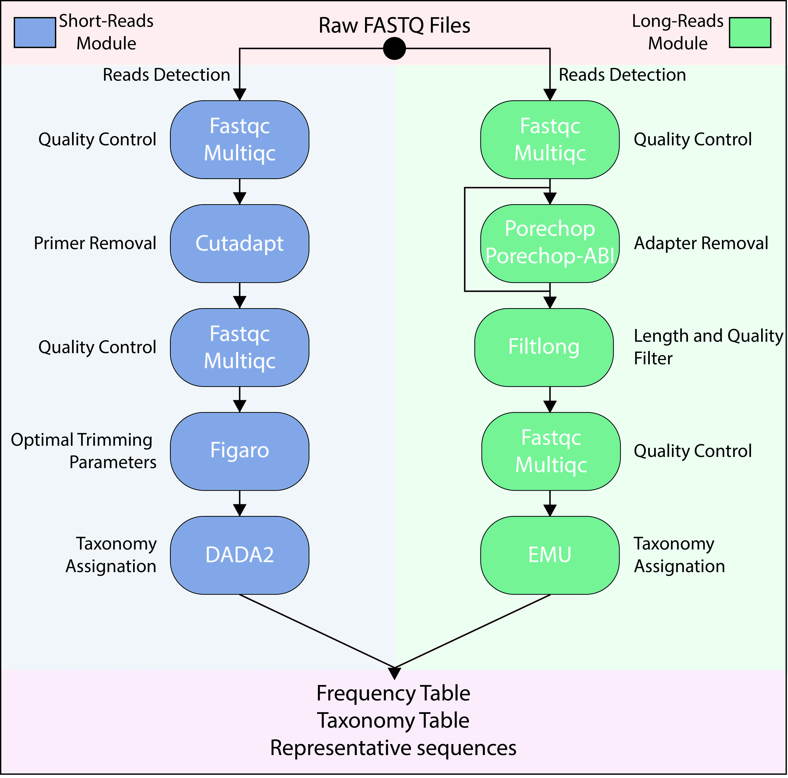

::: {.lang-block .lang-it}
## AmpWrap per il pretrattamento delle raw reads

Per il pretrattamento useremo AmpWrap, il modulo Illumina del workflow pensato per passare dalle raw reads al materiale pronto per DADA2.
:::

::: {.lang-block .lang-en}
## AmpWrap for preprocessing raw reads

For preprocessing we use AmpWrap, the Illumina module of the workflow designed to move from raw reads to material ready for DADA2.
:::

```bash
conda activate ampwrap
ampwrap --help
ampwrap short --help
```

Il riferimento del progetto e:

The project reference is:

<https://github.com/LDoni/AmpWrap>

## Workflow AmpWrap (Illumina) / AmpWrap workflow (Illumina)

1. Initial quality control con FastQC.
2. Report multi-campione con MultiQC.
3. Rimozione primer con Cutadapt (`--discard-untrimmed`).
4. Post-cutadapt FastQC + MultiQC.
5. Determinazione dei parametri ottimali con FIGARO.
6. Inferenza delle ASV con DADA2.

## Schema del workflow / Workflow diagram

```{mermaid}
flowchart LR
  A[Raw FASTQ] --> B[FastQC]
  B --> C[MultiQC]
  C --> D[Cutadapt<br/>--discard-untrimmed]
  D --> E[FastQC]
  E --> F[MultiQC]
  F --> G[FIGARO]
  G --> H[DADA2]
  H --> I[ASV table]
  H --> J[Representative sequences]
  H --> K[Tracking report]
```

::: {.callout-tip}
La figura riassuntiva del flusso AmpWrap e la stessa che useremo a lezione per seguire il passaggio da raw reads a ASV:
:::

{fig-alt="Schema del workflow AmpWrap"}

## Help del comando / Command help

```bash
conda activate ampwrap


ampwrap short --help
```

## Uso di base / Basic usage

```bash
ampwrap short -i input_directory -a forward_primer -A reverse_primer -l amplicon_length
```

::: {.callout-note}
Il comando va adattato al disegno sperimentale. Primer, lunghezza attesa e orientamento delle reads non sono parametri da copiare ciecamente tra dataset diversi.
:::

::: {.callout-note}
The command must be adapted to the experimental design. Primers, expected length, and read orientation are not parameters to copy blindly across datasets.
:::

## Scaricare i dati di esempio / Download the example data

```bash
mkdir -p raw_fastqc
wget --no-check-certificate 'https://drive.usercontent.google.com/download?export=download&id=16nTZKwVmxrFkrT-26-IZtlMetjqDTO3r&confirm=t' -O raw_fastqc/S2_11_L001_R2_001.fastq.gz
wget --no-check-certificate 'https://drive.usercontent.google.com/download?export=download&id=1zHKpcZwgNRCe9_h8BqAJZJsG1OyFRW8_&confirm=t' -O raw_fastqc/S2_11_L001_R1_001.fastq.gz
wget --no-check-certificate 'https://drive.usercontent.google.com/download?export=download&id=1oQ2yNHI1JPuu2-NOq3IMdUBq2It8U3P9&confirm=t' -O raw_fastqc/S1_10_L001_R2_001.fastq.gz
wget --no-check-certificate 'https://drive.usercontent.google.com/download?export=download&id=1RmrDN98kDsxc40pVI2rpmP4LRNCYlvxT&confirm=t' -O raw_fastqc/S1_10_L001_R1_001.fastq.gz
```

## Esecuzione AmpWrap / Running AmpWrap

```bash
ampwrap short -i raw_fastqc -a GTGYCAGCMGCCGCGGTAA -A CCGYCAATTYMTTTRAGTTT -l 372 -o short_test_output
```

## Analisi output / Output inspection

FastQC e MultiQC si aprono come report HTML e servono per controllare qualita, adattatori e distribuzione delle reads prima e dopo il trimming.

FastQC and MultiQC open as HTML reports and are used to check quality, adapters, and read distribution before and after trimming.

Il file finale riassume i passaggi svolti, le reads mantenute e gli output prodotti.

The final report summarizes the steps performed, the reads retained, and the outputs produced.

```bash
cat ......../final_report.txt
```

## Cosa osservare / What to look for

1. Il primo controllo qualita mostra campioni anomali?
2. La rimozione dei primer elimina una quota plausibile di reads?
3. FIGARO suggerisce tagli coerenti con la lunghezza dell'amplicone?
4. Il report finale contiene ASV, sequenze rappresentative e tracciamento del flusso?
