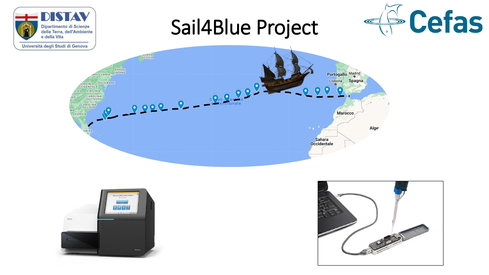
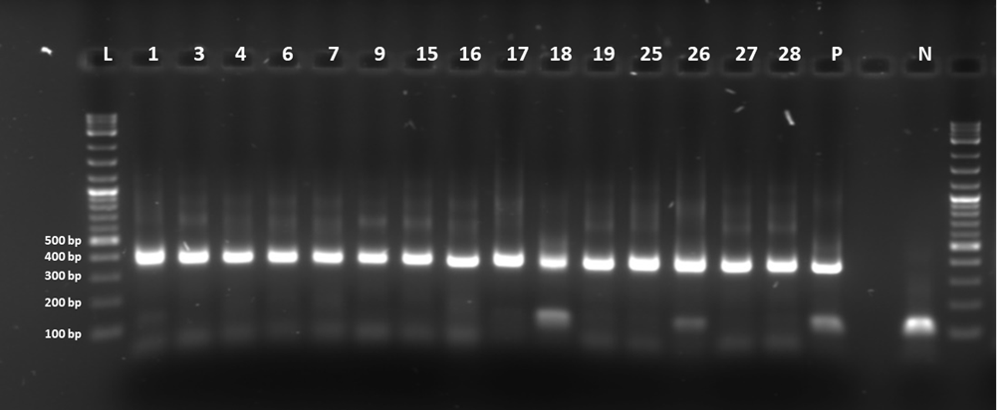
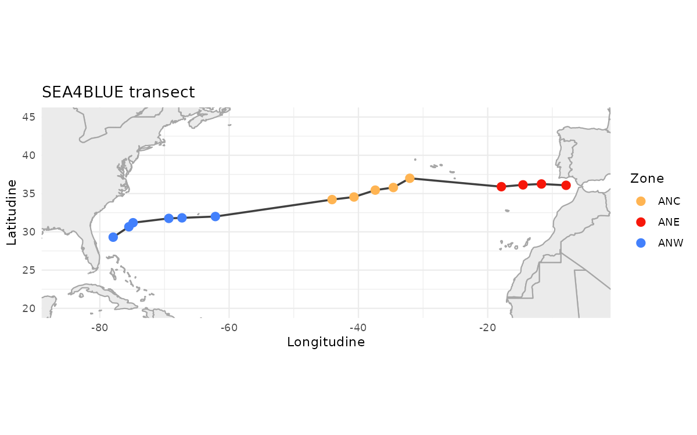
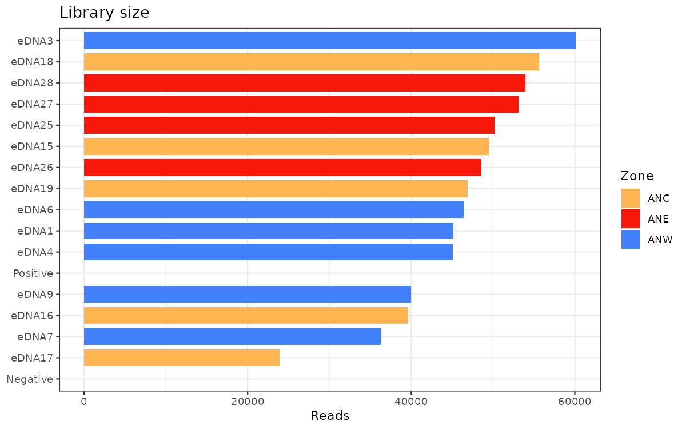
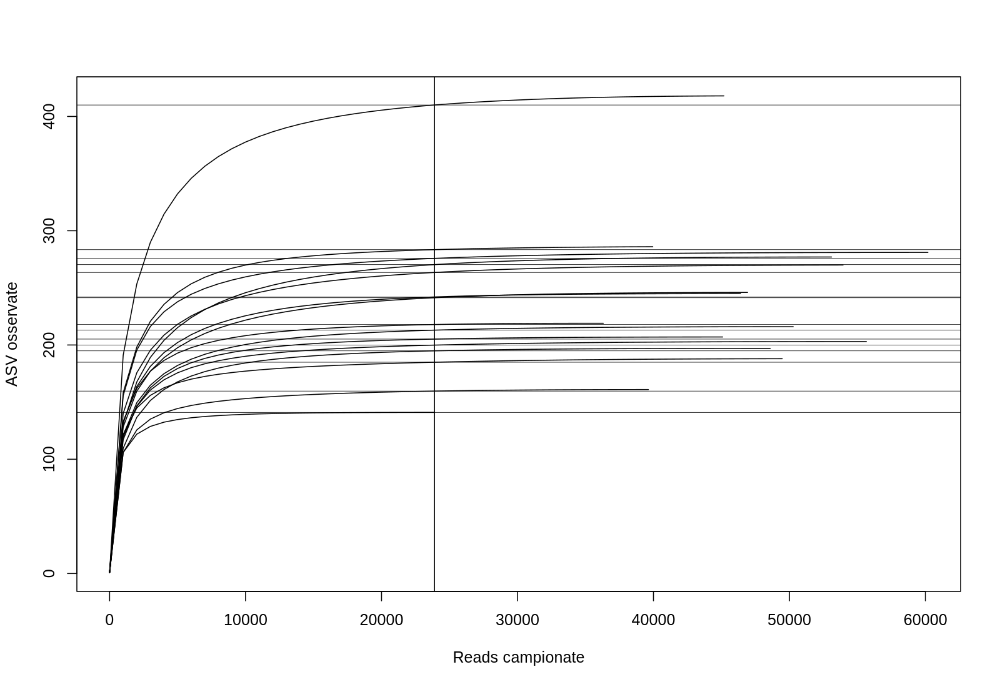
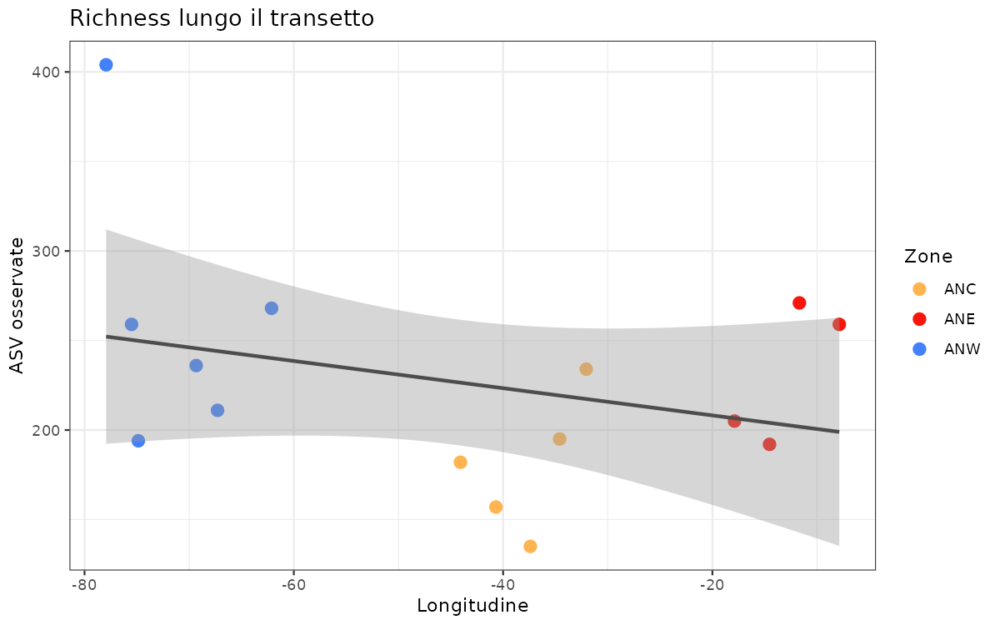
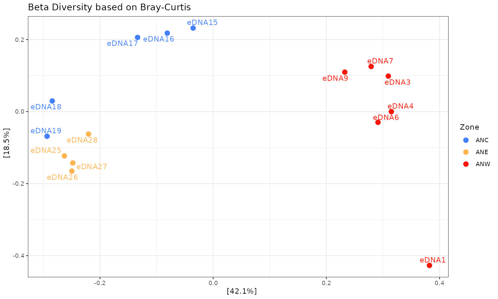
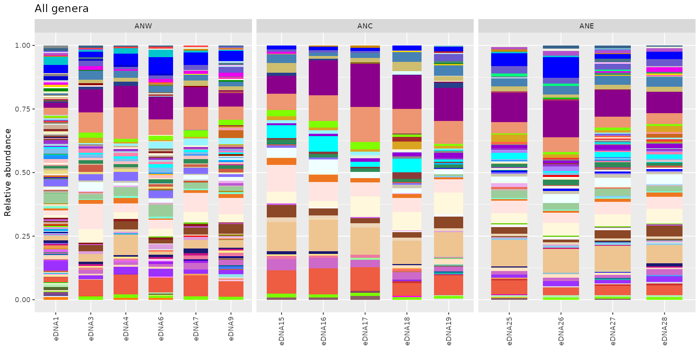
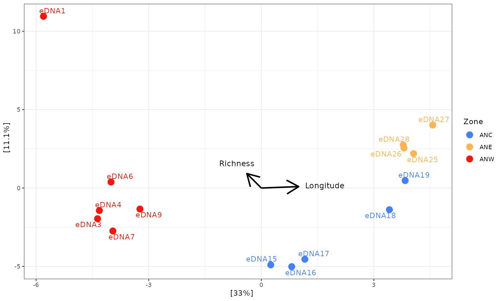
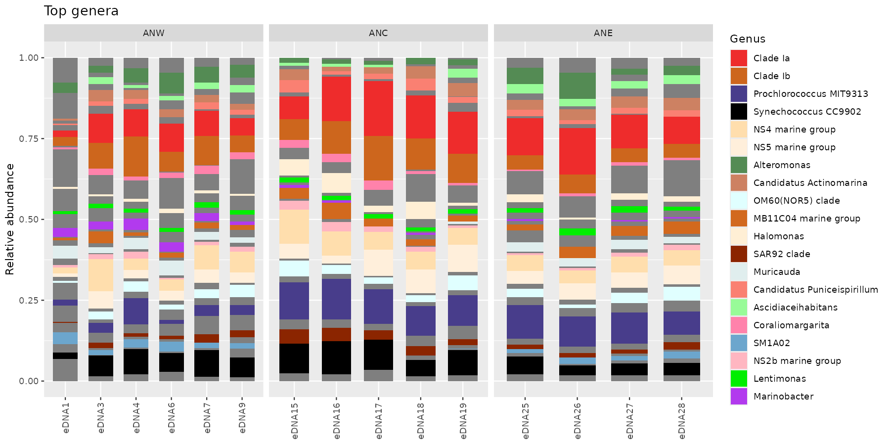

::: {.lang-it}
# SEA4BLUE Project

I campioni SEA4BLUE sono stati raccolti nell'Oceano Atlantico settentrionale, dalla Florida alle Azzorre, lungo un transetto longitudinale, tra maggio e giugno 2022. La raccolta è stata fatta con l'eDNA Citizen Scientist Sampler e il Self-preserving eDNA Filter. Ogni campione corrisponde a circa 8–10 litri di acqua filtrata. I filtri sono stati conservati a temperatura ambiente e il DNA è stato estratto con il kit DNeasy PowerWater di Qiagen.

Il gene 16S rRNA, regione V4, è stato amplificato partendo da 5 ng di DNA per campione.

[Scarica Sea4Blue.zip](downloads/Sea4Blue.zip){.btn .btn-primary download="Sea4Blue.zip"}

{fig-align="center" width="86%"}

{fig-align="center" width="65%"}

---

## I dati che useremo sono già stati pre-processati con DADA2 e la tassonomia è stata assegnata con Silva DB

Che cosa significa "pre-processing"?

- ispezione dei profili di qualità;
- rimozione degli adaptor;
- filtro di qualità e trimming;
- inferenza delle ASV;
- merge delle paired reads;
- rimozione dei chimerici.

Che cosa produce DADA2?

- tabella ASV;
- sequenze rappresentative.

Che cosa serve a `phyloseq`?

- tabella ASV;
- sequenze rappresentative;
- tabella tassonomica;
- metadata.

## Analisi in R

Questa pagina è volutamente statica: il codice serve da guida, ma i grafici sono già pronti e mostrati nel flusso della lezione.

Prima di aprire RStudio, scaricate il dataset e decomprimetelo nella vostra cartella `Downloads`.

Se avete estratto lo zip in `~/Downloads/Sea4Blue`, la working directory deve puntare lì prima di leggere il file `.rds`.

```r
# Puliamo la sessione
rm(list = ls())

# Carichiamo i pacchetti necessari
library(phyloseq)
library(ggplot2)
library(dplyr)
library(maps)
library(ggrepel)
library(ggside)
library(metagenomeSeq)
library(vegan)

# Impostiamo la cartella di lavoro dove avete estratto Sea4Blue.zip
setwd("~/Downloads/Sea4Blue")

# Carichiamo l'oggetto phyloseq già pronto
ps <- readRDS("phyloseq.rds")

# Controlliamo che tutto sia a posto
ps
sample_data(ps)
head(t(otu_table(ps)))
```

::: {.callout-tip}
Se avete salvato il dataset in un'altra posizione, cambiate solo il percorso di `setwd()`. Per esempio: `setwd("~/Desktop/Sea4Blue")`.
:::

### Controllo rapido dell'oggetto `phyloseq`

Se volete capire subito cosa state caricando, guardate queste tre parti dell'oggetto:

```r
# Metadata dei campioni
sample_data(ps)

# Tabella dei taxa
head(tax_table(ps))

# Tabella di abbondanza
head(t(otu_table(ps)))
```

## Mappa del transetto

Questa è la prima vista utile: mostra i siti di campionamento lungo il transetto e aiuta a leggere tutti i grafici successivi.

```r
# Convertiamo il metadata in tabella
samdf <- as.data.frame(sample_data(ps))

# Ordiniamo i campioni lungo il transetto
samdf <- samdf[order(samdf$NavigationDay), ]

# Recuperiamo la mappa del mondo
world <- map_data("world")

# Disegniamo il transetto
ggplot() +
  geom_polygon(
    data = world,
    aes(x = long, y = lat, group = group),
    fill = "grey90",
    color = "grey60"
  ) +
  geom_path(
    data = samdf,
    aes(x = Longitude, y = Latitude, group = 1),
    color = "black",
    linewidth = 1
  ) +
  geom_point(
    data = samdf,
    aes(x = Longitude, y = Latitude, color = Zone),
    size = 3
  ) +
  coord_quickmap(xlim = c(-85, -5), ylim = c(20, 45)) +
  labs(x = "Longitudine", y = "Latitudine", color = "Zona") +
  theme_minimal()
```

{fig-align="center" width="90%"}

## Profondità di sequenziamento e rarefaction curves

Qui conviene ragionare in due passaggi: prima guardiamo quante reads ha ogni campione, poi verifichiamo se la profondità di sequenziamento è sufficiente per confrontare i campioni in modo equo.

```r
# Usiamo i conteggi grezzi per stimare la profondità di sequenziamento
depth_df <- data.frame(
  Sample = sample_names(ps),
  Reads = sample_sums(ps),
  Zone = sample_data(ps)$Zone,
  SampleName = sample_data(ps)$SampleName
)

# Un controllo rapido della libreria
ggplot(depth_df, aes(x = reorder(SampleName, Reads), y = Reads, fill = Zone)) +
  geom_col(width = 0.8) +
  coord_flip() +
  scale_fill_manual(values = c(ANW = "#4280fc", ANC = "#ffb452", ANE = "#f7170a"), na.translate = FALSE) +
  labs(x = NULL, y = "Reads", title = "Library size") +
  theme_bw()
```

{fig-align="center" width="90%"}

```r
# Fissiamo il seed per rendere riproducibile il downsampling
set.seed(42)

# Teniamo solo i campioni con zona assegnata
ps_rarefaction <- subset_samples(ps, !is.na(Zone))

# Funzione originale, resa esplicita passo per passo
calculate_rarefaction_curves <- function(psdata, measures, depths) {
  estimate_rarified_richness <- function(psdata, measures, depth) {
    if (max(sample_sums(psdata)) < depth) return(NULL)
    psdata <- prune_samples(sample_sums(psdata) >= depth, psdata)
    rarified_psdata <- rarefy_even_depth(psdata, depth, verbose = FALSE)
    alpha_diversity <- estimate_richness(rarified_psdata, measures = measures)
    melt(
      as.matrix(alpha_diversity),
      varnames = c("Sample", "Measure"),
      value.name = "Alpha_diversity"
    )
  }

  names(depths) <- depths
  rarefaction_curve_data <- plyr::ldply(
    depths,
    estimate_rarified_richness,
    psdata = psdata,
    measures = measures,
    .id = "Depth"
  )
  rarefaction_curve_data$Depth <- as.numeric(levels(rarefaction_curve_data$Depth))[rarefaction_curve_data$Depth]
  rarefaction_curve_data
}

# Calcoliamo le curve
rarefaction_curve_data <- calculate_rarefaction_curves(
  ps_rarefaction,
  c("Observed"),
  rep(c(1, 10, 100, 1000, 1:100 * 10000), each = 10)
)

# Riassumiamo i valori per il grafico
rarefaction_curve_data_summary <- plyr::ddply(
  rarefaction_curve_data,
  c("Depth", "Sample", "Measure"),
  summarise,
  Alpha_diversity_mean = mean(Alpha_diversity),
  Alpha_diversity_sd = sd(Alpha_diversity)
)
rarefaction_curve_data_summary_verbose <- merge(
  rarefaction_curve_data_summary,
  data.frame(sample_data(ps_rarefaction)),
  by.x = "Sample",
  by.y = "row.names"
)

# Disegniamo le curve colorandole per zona
ggplot(
  data = rarefaction_curve_data_summary_verbose,
  aes(x = Depth, y = Alpha_diversity_mean, group = Sample, color = Zone)
) +
  geom_line(linewidth = 1) +
  geom_point(size = 2.5) +
  geom_label_repel(
    data = rarefaction_curve_data_summary_verbose |>
      dplyr::group_by(Sample) |>
      dplyr::filter(Alpha_diversity_mean == max(Alpha_diversity_mean)),
    aes(label = SampleName),
    color = "black",
    show.legend = FALSE
  ) +
  scale_color_manual(values = c(ANW = "#4280fc", ANC = "#ffb452", ANE = "#f7170a")) +
  labs(x = "Profondità", y = "ASV osservate", title = "Rarefaction Curves") +
  theme_bw()
```

{fig-align="center" width="90%"}

## Normalizzazione

Qui facciamo i passaggi che servono davvero per la lezione: togliamo i taxa indesiderati, filtriamo i singletons, escludiamo i controlli e applichiamo CSS.

```r
# Partiamo dall'oggetto iniziale
phyloseq_obj <- ps

# Rimuoviamo cloroplasti e mitocondri
phyloseq_obj <- phyloseq_obj |>
  subset_taxa((is.na(Family) | Family != "Mitochondria") & (is.na(Order) | Order != "Chloroplast"))

# Teniamo solo i taxa osservati più di una volta
phyloseq_obj <- prune_taxa(taxa_sums(phyloseq_obj) > 1, phyloseq_obj)

# Escludiamo i controlli
phyloseq_obj <- subset_samples(
  phyloseq_obj,
  !is.na(Zone) & SampleName != "Positive" & SampleName != "Negative"
)

# Convertiamo in oggetto metagenomeSeq e applichiamo CSS
data.metagenomeSeq <- phyloseq_to_metagenomeSeq(phyloseq_obj)
p <- cumNormStat(data.metagenomeSeq)
data.cumnorm <- cumNorm(data.metagenomeSeq, p = p)
data.CSS <- MRcounts(data.cumnorm, norm = TRUE, log = TRUE)

# Ricreiamo l'oggetto phyloseq normalizzato
phyloseq_obj_css <- phyloseq_obj
otu_table(phyloseq_obj_css) <- otu_table(data.CSS, taxa_are_rows = TRUE)

# Rinominamo i campioni con il nome leggibile
sample_names(phyloseq_obj_css) <- sample_data(phyloseq_obj_css)$SampleName
```

## Alpha diversity

In questa pagina teniamo la stessa logica della lezione originale: prima arrotondiamo i conteggi normalizzati, poi stimiamo la richness e infine la leggiamo lungo il transetto.

```r
# Arrotondiamo i conteggi normalizzati per la richness
phyloseq_obj_css_round <- phyloseq_obj_css
otu_table(phyloseq_obj_css_round) <- round(otu_table(phyloseq_obj_css), digits = 0)

# Calcoliamo la richness osservata
p1 <- plot_richness(
  phyloseq_obj_css_round,
  x = "Longitude",
  color = "Zone",
  measures = c("Observed")
)

# Ordiniamo le zone come nel corso
newSTorder <- c("ANW", "ANC", "ANE")
p1$data$Zone <- factor(as.character(p1$data$Zone), levels = newSTorder)

# Disegno finale
ggplot(p1$data, aes(Longitude, value)) +
  theme_bw() +
  theme(plot.title = element_text(hjust = 0.5), ggside.panel.scale.y = 0.4) +
  geom_point(aes(colour = Zone), alpha = 0.45) +
  scale_color_manual(values = c("#4280fc", "#ffb452", "#f7170a", "#000000")) +
  geom_ysideboxplot(aes(x = Zone, y = value, colour = Zone), orientation = "x") +
  scale_ysidex_discrete() +
  geom_smooth(aes(colour = variable), linewidth = 1.5) +
  ylab("Richness")
```

{fig-align="center" width="90%"}

```r
# Salviamo la richness nei metadata: ci servirà dopo
sample_data(phyloseq_obj_css)$Richness <- p1$data$value
```

## Beta diversity

Qui ci fermiamo alla PCoA su Bray-Curtis. La lezione originale mostrava anche il controllo sulle dispersioni, ma in questa versione didattica lo togliamo per mantenere il flusso più lineare.

```r
# Calcoliamo l'ordinamento Bray-Curtis
otu.ord <- ordinate(phyloseq_obj_css, "PCoA", distance = "bray")

# Disegniamo la PCoA con le etichette
plot_ordination(phyloseq_obj_css, otu.ord, color = "Zone", axes = c(1, 2)) +
  scale_color_manual(values = c("#4280fc", "#ffb452", "#f7170a")) +
  geom_point(size = 3) +
  geom_text_repel(aes(label = SampleName), max.overlaps = Inf, show.legend = FALSE) +
  labs(title = "Beta Diversity based on Bray-Curtis") +
  theme_bw()
```

{fig-align="center" width="90%"}

## Composizione della comunità e RDA

Prima guardiamo la composizione tassonomica a livello di genere, poi chiudiamo con una RDA vincolata dalla longitudine e dalla richness.

```r
# Convertiamo i conteggi in percentuale
physeq_perc <- transform_sample_counts(phyloseq_obj_css, function(x) 100 * x / sum(x))

# Agreghiamo al livello di genere
glom <- tax_glom(physeq_perc, taxrank = "Genus")
data_glom <- psmelt(glom)
data_glom$Zone <- factor(as.character(data_glom$Zone), levels = c("ANW", "ANC", "ANE"))

# Palette molto ampia per i generi
color <- grDevices::colors()[grep("gr(a|e)y", grDevices::colors(), invert = TRUE)]

# Barplot di tutti i generi
ggplot(data = data_glom, aes(x = Sample, y = Abundance, fill = Genus)) +
  facet_grid(~Zone, scales = "free") +
  geom_bar(stat = "identity", position = "fill", width = 0.7) +
  scale_fill_manual(values = sample(color, length(unique(data_glom$Genus)))) +
  theme(axis.text.x = element_text(angle = 90, vjust = 0.5, hjust = 1), legend.position = "none")
```

{fig-align="center" width="95%"}

```r
# Identifichiamo i taxa più abbondanti
genus.sum <- tapply(taxa_sums(glom), tax_table(glom)[, "Genus"], sum, na.rm = TRUE)
topGenera <- names(sort(genus.sum, TRUE))[1:20]

# Stesso grafico, ma con i top genera evidenziati
ggplot(data = data_glom, aes(x = Sample, y = Abundance, fill = Genus)) +
  facet_grid(~Zone, scales = "free") +
  geom_bar(stat = "identity", position = "fill", width = 0.7) +
  scale_fill_manual(values = sample(color, length(unique(data_glom$Genus))), breaks = topGenera) +
  theme(axis.text.x = element_text(angle = 90, vjust = 0.5, hjust = 1))
```

```r
# RDA sulla comunità
RDA <- ordinate(phyloseq_obj_css ~ Richness + Longitude, "RDA")

# Primo grafico: campioni colorati per zona
p2 <- plot_ordination(phyloseq_obj_css, RDA, color = "Zone") +
  theme_bw() +
  geom_text_repel(aes(label = SampleName, color = Zone), max.overlaps = Inf, show.legend = FALSE) +
  geom_point(size = 4) +
  scale_color_manual(values = c("#4280fc", "#ffb452", "#f7170a"))

# Aggiungiamo le frecce delle variabili esplicative
arrowmat <- vegan::scores(RDA, display = "bp")
arrowdf <- data.frame(labels = rownames(arrowmat), arrowmat)
arrowhead <- grid::arrow(length = grid::unit(0.05, "npc"))

p2 +
  geom_segment(
    aes(xend = RDA1, yend = RDA2, x = 0, y = 0),
    data = arrowdf,
    color = "black",
    arrow = arrowhead,
    linewidth = 1
  ) +
  geom_text(
    aes(x = 1.7 * RDA1, y = 1.7 * RDA2, label = labels),
    data = arrowdf,
    size = 4
  )
```

{fig-align="center" width="90%"}

## Nota finale

Questo tutorial resta statico apposta: il codice è mostrato per essere letto e discusso, mentre le figure sono già pronte. In aula, il punto è capire la sequenza logica dell'analisi, non perdere tempo con output rumorosi o blocchi troppo automatici.
:::

::: {.lang-en}
# SEA4BLUE Project

SEA4BLUE samples were collected in the North Atlantic, from Florida to the Azores, along a longitudinal transect during May and June 2022. They were collected with the eDNA Citizen Scientist Sampler and the Self-preserving eDNA Filter. Each sample corresponds to about 8–10 liters of filtered seawater. The filters were stored at room temperature, and DNA was extracted with the Qiagen DNeasy PowerWater kit.

The V4 region of the 16S rRNA gene was amplified starting from 5 ng of DNA per sample.

[Download Sea4Blue.zip](downloads/Sea4Blue.zip){.btn .btn-primary download="Sea4Blue.zip"}

{fig-align="center" width="86%"}

{fig-align="center" width="65%"}

---

## The data we will use have already been pre-processed with DADA2 and the taxonomy was assigned using Silva DB

What does "pre-processing" include?

- inspect read quality profiles;
- remove adapters;
- quality filter and trim;
- infer ASVs;
- merge paired reads;
- remove chimeras.

What are the outputs of DADA2?

- ASV table;
- representative sequences.

What are the inputs for `phyloseq`?

- ASV table;
- representative sequences;
- taxonomy table;
- metadata.

## Analysis in R

This page is intentionally static: the code is there to guide the discussion, while the figures are already prepared and shown in sequence.

Before opening RStudio, download the dataset and unzip it into your `Downloads` folder.

## Getting started in R

If you extracted the zip into `~/Downloads/Sea4Blue`, your working directory must point there before reading the `.rds` file.

```r
# Clear the workspace
rm(list = ls())

# Load the required packages
library(phyloseq)
library(ggplot2)
library(dplyr)
library(maps)
library(ggrepel)
library(ggside)
library(metagenomeSeq)
library(vegan)

# Set the working directory where Sea4Blue.zip was extracted
setwd("~/Downloads/Sea4Blue")

# Load the ready-to-use phyloseq object
ps <- readRDS("phyloseq.rds")

# Quick sanity checks
ps
sample_data(ps)
head(t(otu_table(ps)))
```

::: {.callout-tip}
If you stored the dataset somewhere else, change only the `setwd()` path. For example: `setwd("~/Desktop/Sea4Blue")`.
:::

### Quick check of the `phyloseq` object

If you want to see immediately what was loaded, inspect these three components:

```r
# Sample metadata
sample_data(ps)

# Taxonomy table
head(tax_table(ps))

# Abundance table
head(t(otu_table(ps)))
```

## Transect map

This is the first useful view: it shows the sampling sites along the transect and makes the later plots easier to read.

```r
# Turn sample metadata into a data frame
samdf <- as.data.frame(sample_data(ps))

# Order samples along the transect
samdf <- samdf[order(samdf$NavigationDay), ]

# Retrieve the world map
world <- map_data("world")

# Plot the transect
ggplot() +
  geom_polygon(
    data = world,
    aes(x = long, y = lat, group = group),
    fill = "grey90",
    color = "grey60"
  ) +
  geom_path(
    data = samdf,
    aes(x = Longitude, y = Latitude, group = 1),
    color = "black",
    linewidth = 1
  ) +
  geom_point(
    data = samdf,
    aes(x = Longitude, y = Latitude, color = Zone),
    size = 3
  ) +
  coord_quickmap(xlim = c(-85, -5), ylim = c(20, 45)) +
  labs(x = "Longitude", y = "Latitude", color = "Zone") +
  theme_minimal()
```

{fig-align="center" width="90%"}

## Sequencing depth and rarefaction curves

Here we work in two stages: first we inspect how many reads each sample has, then we check whether sequencing depth is sufficient for fair comparisons.

```r
# Use raw counts to inspect sequencing depth
depth_df <- data.frame(
  Sample = sample_names(ps),
  Reads = sample_sums(ps),
  Zone = sample_data(ps)$Zone,
  SampleName = sample_data(ps)$SampleName
)

# Quick library-size check
ggplot(depth_df, aes(x = reorder(SampleName, Reads), y = Reads, fill = Zone)) +
  geom_col(width = 0.8) +
  coord_flip() +
  scale_fill_manual(values = c(ANW = "#4280fc", ANC = "#ffb452", ANE = "#f7170a"), na.translate = FALSE) +
  labs(x = NULL, y = "Reads", title = "Library size") +
  theme_bw()
```

{fig-align="center" width="90%"}

```r
# Fix the seed to keep the downsampling reproducible
set.seed(42)

# Keep only samples with an assigned zone
ps_rarefaction <- subset_samples(ps, !is.na(Zone))

# Original logic, written out step by step
calculate_rarefaction_curves <- function(psdata, measures, depths) {
  estimate_rarified_richness <- function(psdata, measures, depth) {
    if (max(sample_sums(psdata)) < depth) return(NULL)
    psdata <- prune_samples(sample_sums(psdata) >= depth, psdata)
    rarified_psdata <- rarefy_even_depth(psdata, depth, verbose = FALSE)
    alpha_diversity <- estimate_richness(rarified_psdata, measures = measures)
    melt(
      as.matrix(alpha_diversity),
      varnames = c("Sample", "Measure"),
      value.name = "Alpha_diversity"
    )
  }

  names(depths) <- depths
  rarefaction_curve_data <- plyr::ldply(
    depths,
    estimate_rarified_richness,
    psdata = psdata,
    measures = measures,
    .id = "Depth"
  )
  rarefaction_curve_data$Depth <- as.numeric(levels(rarefaction_curve_data$Depth))[rarefaction_curve_data$Depth]
  rarefaction_curve_data
}

# Compute the curves
rarefaction_curve_data <- calculate_rarefaction_curves(
  ps_rarefaction,
  c("Observed"),
  rep(c(1, 10, 100, 1000, 1:100 * 10000), each = 10)
)

# Summarize values for plotting
rarefaction_curve_data_summary <- plyr::ddply(
  rarefaction_curve_data,
  c("Depth", "Sample", "Measure"),
  summarise,
  Alpha_diversity_mean = mean(Alpha_diversity),
  Alpha_diversity_sd = sd(Alpha_diversity)
)
rarefaction_curve_data_summary_verbose <- merge(
  rarefaction_curve_data_summary,
  data.frame(sample_data(ps_rarefaction)),
  by.x = "Sample",
  by.y = "row.names"
)

# Plot the curves colored by zone
ggplot(
  data = rarefaction_curve_data_summary_verbose,
  aes(x = Depth, y = Alpha_diversity_mean, group = Sample, color = Zone)
) +
  geom_line(linewidth = 1) +
  geom_point(size = 2.5) +
  geom_label_repel(
    data = rarefaction_curve_data_summary_verbose |>
      dplyr::group_by(Sample) |>
      dplyr::filter(Alpha_diversity_mean == max(Alpha_diversity_mean)),
    aes(label = SampleName),
    color = "black",
    show.legend = FALSE
  ) +
  scale_color_manual(values = c(ANW = "#4280fc", ANC = "#ffb452", ANE = "#f7170a")) +
  labs(x = "Depth", y = "Observed ASVs", title = "Rarefaction Curves") +
  theme_bw()
```

{fig-align="center" width="90%"}

## Normalization

Here we keep only the steps that matter for the lesson: remove unwanted taxa, filter singletons, exclude controls, and apply CSS.

```r
# Start from the initial object
phyloseq_obj <- ps

# Remove chloroplasts and mitochondria
phyloseq_obj <- phyloseq_obj |>
  subset_taxa((is.na(Family) | Family != "Mitochondria") & (is.na(Order) | Order != "Chloroplast"))

# Keep only taxa observed more than once
phyloseq_obj <- prune_taxa(taxa_sums(phyloseq_obj) > 1, phyloseq_obj)

# Remove controls
phyloseq_obj <- subset_samples(
  phyloseq_obj,
  !is.na(Zone) & SampleName != "Positive" & SampleName != "Negative"
)

# Convert to metagenomeSeq and apply CSS
data.metagenomeSeq <- phyloseq_to_metagenomeSeq(phyloseq_obj)
p <- cumNormStat(data.metagenomeSeq)
data.cumnorm <- cumNorm(data.metagenomeSeq, p = p)
data.CSS <- MRcounts(data.cumnorm, norm = TRUE, log = TRUE)

# Rebuild the normalized phyloseq object
phyloseq_obj_css <- phyloseq_obj
otu_table(phyloseq_obj_css) <- otu_table(data.CSS, taxa_are_rows = TRUE)

# Rename samples with their readable sample names
sample_names(phyloseq_obj_css) <- sample_data(phyloseq_obj_css)$SampleName
```

## Alpha diversity

We keep the same logic used in the original lesson: round the normalized counts, estimate richness, and read it along the transect.

```r
# Round normalized counts for richness
phyloseq_obj_css_round <- phyloseq_obj_css
otu_table(phyloseq_obj_css_round) <- round(otu_table(phyloseq_obj_css), digits = 0)

# Compute observed richness
p1 <- plot_richness(
  phyloseq_obj_css_round,
  x = "Longitude",
  color = "Zone",
  measures = c("Observed")
)

# Keep the same zone order as in the course
newSTorder <- c("ANW", "ANC", "ANE")
p1$data$Zone <- factor(as.character(p1$data$Zone), levels = newSTorder)

# Final figure
ggplot(p1$data, aes(Longitude, value)) +
  theme_bw() +
  theme(plot.title = element_text(hjust = 0.5), ggside.panel.scale.y = 0.4) +
  geom_point(aes(colour = Zone), alpha = 0.45) +
  scale_color_manual(values = c("#4280fc", "#ffb452", "#f7170a", "#000000")) +
  geom_ysideboxplot(aes(x = Zone, y = value, colour = Zone), orientation = "x") +
  scale_ysidex_discrete() +
  geom_smooth(aes(colour = variable), linewidth = 1.5) +
  ylab("Richness")
```

{fig-align="center" width="90%"}

```r
# Save richness in the metadata for later use
sample_data(phyloseq_obj_css)$Richness <- p1$data$value
```

## Beta diversity

Here we stop at the PCoA on Bray-Curtis. The original lesson also discussed dispersion checks, but this static version keeps the flow simpler.

```r
# Compute the Bray-Curtis ordination
otu.ord <- ordinate(phyloseq_obj_css, "PCoA", distance = "bray")

# Draw the PCoA with labels
plot_ordination(phyloseq_obj_css, otu.ord, color = "Zone", axes = c(1, 2)) +
  scale_color_manual(values = c("#4280fc", "#ffb452", "#f7170a")) +
  geom_point(size = 3) +
  geom_text_repel(aes(label = SampleName), max.overlaps = Inf, show.legend = FALSE) +
  labs(title = "Beta Diversity based on Bray-Curtis") +
  theme_bw()
```

{fig-align="center" width="90%"}

## Community composition and RDA

First we look at the taxonomic composition at genus level, then we close with an RDA constrained by longitude and richness.

```r
# Convert counts to percentages
physeq_perc <- transform_sample_counts(phyloseq_obj_css, function(x) 100 * x / sum(x))

# Aggregate at genus level
glom <- tax_glom(physeq_perc, taxrank = "Genus")
data_glom <- psmelt(glom)
data_glom$Zone <- factor(as.character(data_glom$Zone), levels = c("ANW", "ANC", "ANE"))

# Large palette for genera
color <- grDevices::colors()[grep("gr(a|e)y", grDevices::colors(), invert = TRUE)]

# All genera
ggplot(data = data_glom, aes(x = Sample, y = Abundance, fill = Genus)) +
  facet_grid(~Zone, scales = "free") +
  geom_bar(stat = "identity", position = "fill", width = 0.7) +
  scale_fill_manual(values = sample(color, length(unique(data_glom$Genus)))) +
  theme(axis.text.x = element_text(angle = 90, vjust = 0.5, hjust = 1), legend.position = "none")
```

{fig-align="center" width="95%"}

```r
# Identify the most abundant taxa
genus.sum <- tapply(taxa_sums(glom), tax_table(glom)[, "Genus"], sum, na.rm = TRUE)
topGenera <- names(sort(genus.sum, TRUE))[1:20]

# Same plot, highlighting the top genera
ggplot(data = data_glom, aes(x = Sample, y = Abundance, fill = Genus)) +
  facet_grid(~Zone, scales = "free") +
  geom_bar(stat = "identity", position = "fill", width = 0.7) +
  scale_fill_manual(values = sample(color, length(unique(data_glom$Genus))), breaks = topGenera) +
  theme(axis.text.x = element_text(angle = 90, vjust = 0.5, hjust = 1))
```

{fig-align="center" width="95%"}

```r
# RDA on the community
RDA <- ordinate(phyloseq_obj_css ~ Richness + Longitude, "RDA")

# First plot: samples colored by zone
p2 <- plot_ordination(phyloseq_obj_css, RDA, color = "Zone") +
  theme_bw() +
  geom_text_repel(aes(label = SampleName, color = Zone), max.overlaps = Inf, show.legend = FALSE) +
  geom_point(size = 4) +
  scale_color_manual(values = c("#4280fc", "#ffb452", "#f7170a"))

# Add arrows for explanatory variables
arrowmat <- vegan::scores(RDA, display = "bp")
arrowdf <- data.frame(labels = rownames(arrowmat), arrowmat)
arrowhead <- grid::arrow(length = grid::unit(0.05, "npc"))

p2 +
  geom_segment(
    aes(xend = RDA1, yend = RDA2, x = 0, y = 0),
    data = arrowdf,
    color = "black",
    arrow = arrowhead,
    linewidth = 1
  ) +
  geom_text(
    aes(x = 1.7 * RDA1, y = 1.7 * RDA2, label = labels),
    data = arrowdf,
    size = 4
  )
```

{fig-align="center" width="90%"}

## Final note

This tutorial is intentionally static: the code is there to be read and discussed, while the figures are already ready to use. The point in class is to understand the analytical sequence, not to spend time on noisy output or overly automated steps.
:::
