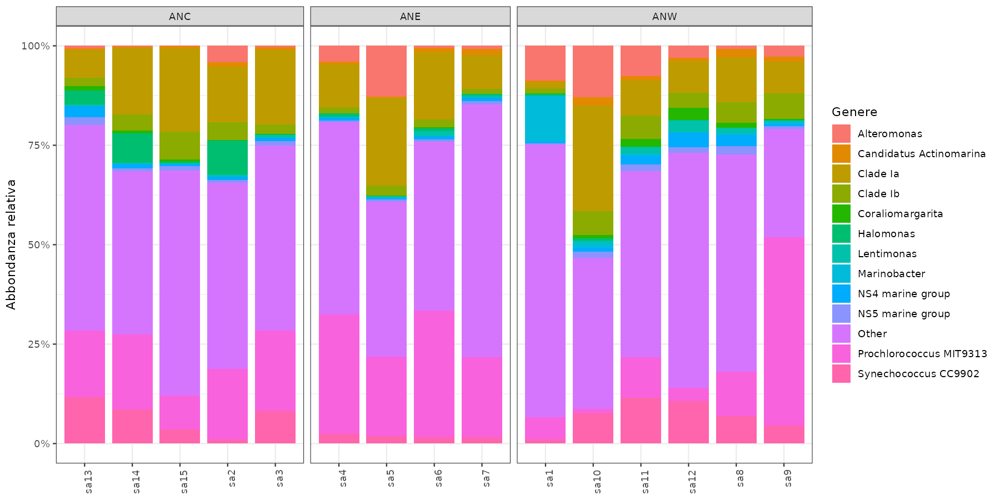

::: {.lang-block .lang-it}
## Obiettivi della sessione

Questa lezione segue il percorso biologico del dataset SEA4BLUE: dal transetto oceanico ai grafici di diversita, fino ai test multivariati.

- conti grezzi per profondita di sequenziamento e diversita alfa;
- abbondanze relative per composizione e Bray-Curtis;
- trasformazione di Hellinger per la RDA.

Il punto didattico non e fare tutto con un unico comando, ma vedere come cambia l'oggetto a ogni passaggio.
:::

::: {.lang-block .lang-en}
## Session goals

This lesson follows the biological story of the SEA4BLUE dataset: from the ocean transect to diversity plots and multivariate tests.

- raw counts for sequencing depth and alpha diversity;
- relative abundances for composition and Bray-Curtis;
- Hellinger-transformed data for RDA.

The teaching goal is not to compress everything into one command, but to watch how the object changes at each step.
:::

::: {.callout-important}
Non eseguite l'intera pagina o lo script con un solo comando. Dopo ogni blocco controllate dimensioni, nomi e grafico ottenuto.
:::

::: {.lang-block .lang-it}
## 0. Download e progetto RStudio
:::

::: {.lang-block .lang-en}
## 0. Download and RStudio project
:::

::: {.download-box}
[Scarica Sea4Blue.zip](downloads/Sea4Blue.zip){.btn .btn-primary download="Sea4Blue.zip"}
:::

::: {.callout-tip}
Se avete scaricato lo zip nella cartella Download della vostra home, aprite la sessione da lì con:

```bash
setwd("~/Downloads/Sea4Blue")
```

`~` significa "home". Se la vostra cartella si chiama `Scaricati`, il percorso cambia di conseguenza. L'idea e sempre la stessa: portarsi nella cartella dove avete decompresso il dataset prima di lanciare lo script.
:::

::: {.lang-block .lang-it}
1. Decomprimete lo zip.
2. Aprite `Sea4Blue.Rproj`.
3. Aprite `analysis_guided.R`.
4. Verificate che `getwd()` termini con `Sea4Blue`.
:::

::: {.lang-block .lang-en}
1. Unzip the archive.
2. Open `Sea4Blue.Rproj`.
3. Open `analysis_guided.R`.
4. Check that `getwd()` ends with `Sea4Blue`.
:::

::: {.lang-block .lang-it}
## 1. Pacchetti e dati
:::

::: {.lang-block .lang-en}
## 1. Packages and data
:::

```{r}
library(phyloseq)
library(vegan)
library(ggplot2)
library(dplyr)
library(maps)
library(ggrepel)

zone_colors <- c(ANW = "#4280fc", ANC = "#ffb452", ANE = "#f7170a")

ps <- readRDS("materials/Sea4Blue/phyloseq.rds")

ps
```

Un oggetto `phyloseq` collega la tabella ASV, la tassonomia e i metadata dei campioni.

An object of class `phyloseq` links the ASV table, taxonomy and sample metadata.

```{r}
head(t(otu_table(ps))[, 1:6])
head(as.data.frame(tax_table(ps)))
as.data.frame(sample_data(ps))
```

**Fermata / Stop.** Quanti campioni, quante ASV e quali ranghi tassonomici contiene l'oggetto? Individuate controllo positivo e negativo.

::: {.lang-block .lang-it}
## 2. Profondita di sequenziamento
:::

::: {.lang-block .lang-en}
## 2. Sequencing depth
:::

```{r}
#| eval: false
depth_df <- data.frame(
  Sample = sample_names(ps),
  Reads = sample_sums(ps),
  Type = ifelse(is.na(sample_data(ps)$Zone), "Control", "Environmental")
)

ggplot(depth_df, aes(x = reorder(Sample, Reads), y = Reads, fill = Type)) +
  geom_col() +
  coord_flip() +
  labs(x = NULL, y = "Reads", title = "Library size") +
  theme_bw()
```

{fig-alt="Library size per campione"}

::: {.lang-block .lang-it}
I controlli vengono visualizzati insieme ai campioni ambientali per capire subito se hanno profondita anomala.
:::

::: {.lang-block .lang-en}
Controls are shown together with environmental samples so we can immediately spot anomalous library sizes.
:::

**Discussione / Discussion.** Il negativo ha la stessa profondita dei campioni ambientali? Il positivo e un campione ambientale? Profondita elevata significa automaticamente qualita elevata?

::: {.lang-block .lang-it}
### 2.1 Il transetto di campionamento
:::

::: {.lang-block .lang-en}
### 2.1 The sampling transect
:::

::: {.lang-block .lang-it}
Le coordinate sono metadata: prima del grafico le ordiniamo per giorno di navigazione per far leggere il gradiente spaziale in modo corretto.
:::

::: {.lang-block .lang-en}
Coordinates are metadata: before plotting them, we sort samples by navigation day so the spatial gradient is read correctly.
:::

```{r}
#| eval: false
samdf <- data.frame(sample_data(subset_samples(ps, !is.na(Zone))))
samdf <- samdf[order(samdf$NavigationDay), ]
world <- map_data("world")

ggplot() +
  geom_polygon(
    data = world,
    aes(x = long, y = lat, group = group),
    fill = "grey92", color = "grey65"
  ) +
  geom_path(data = samdf, aes(Longitude, Latitude), color = "grey25", linewidth = 0.8) +
  geom_point(data = samdf, aes(Longitude, Latitude, color = Zone), size = 3) +
  coord_quickmap(xlim = c(-85, -5), ylim = c(20, 45)) +
  scale_color_manual(values = zone_colors) +
  labs(x = "Longitudine", y = "Latitudine", title = "SEA4BLUE transect") +
  theme_minimal()
```

{fig-alt="Mappa del transetto SEA4BLUE"}

**Fermata / Stop.** `Zone` rappresenta gruppi indipendenti dalla geografia oppure segmenti dello stesso gradiente? Questa risposta sara importante quando interpreteremo PERMANOVA e RDA.

::: {.lang-block .lang-it}
## 3. Curva di rarefazione
:::

::: {.lang-block .lang-en}
## 3. Rarefaction curve
:::

::: {.lang-block .lang-it}
Qui usiamo `vegan::rarecurve` sui soli campioni ambientali. E uno strumento diagnostico, non la normalizzazione finale dell'analisi.
:::

::: {.lang-block .lang-en}
Here we use `vegan::rarecurve` on environmental samples only. This is a diagnostic tool, not the final normalization for the analysis.
:::

```{r}
#| eval: false
ps_bio <- subset_samples(ps, !is.na(Zone))
otu_bio <- as(otu_table(ps_bio), "matrix")
if (taxa_are_rows(ps_bio)) otu_bio <- t(otu_bio)

set.seed(42)
rarecurve(
  otu_bio,
  step = 1000,
  sample = min(rowSums(otu_bio)),
  label = FALSE,
  xlab = "Reads campionate",
  ylab = "ASV osservate"
)
```

{fig-alt="Curve di rarefazione"}

**Fermata / Stop.** Le curve raggiungono un plateau? Quale informazione perderemmo portando tutti i campioni alla profondita del piu piccolo?

::: {.lang-block .lang-it}
## 4. Filtraggio esplicito
:::

::: {.lang-block .lang-en}
## 4. Explicit filtering
:::

::: {.lang-block .lang-it}
Ogni filtro viene applicato e controllato separatamente, cosi l'oggetto che prosegue nell'analisi e sempre verificabile.
:::

::: {.lang-block .lang-en}
Each filter is applied and checked separately, so the object that continues through the analysis always remains inspectable.
:::

### 4.1 Rimuovere mitocondri e cloroplasti

```{r}
ps_clean <- subset_taxa(
  ps,
  (is.na(Family) | Family != "Mitochondria") &
    (is.na(Order) | Order != "Chloroplast")
)

c(before = ntaxa(ps), after_organelle = ntaxa(ps_clean))
```

### 4.2 Rimuovere ASV con un solo conteggio totale

```{r}
ps_clean <- prune_taxa(taxa_sums(ps_clean) > 1, ps_clean)
ntaxa(ps_clean)
```

### 4.3 Separare i controlli dall'analisi ecologica

```{r}
ps_clean <- subset_samples(ps_clean, !is.na(Zone))
ps_clean <- prune_taxa(taxa_sums(ps_clean) > 0, ps_clean)
ps_clean
```

::: {.callout-note}
I controlli non vengono eliminati per ignorarli: prima si ispezionano per valutare contaminazione e riuscita del run, poi si escludono dal confronto ecologico tra zone.
:::

::: {.callout-note}
Controls are not removed to ignore them: first we inspect them to assess contamination and run success, then we exclude them from the ecological comparison between zones.
:::

::: {.lang-block .lang-it}
## 5. Diversita alfa sui conteggi
:::

::: {.lang-block .lang-en}
## 5. Alpha diversity on counts
:::

La richness e il numero di ASV osservate nel campione; Shannon combina richness ed evenness.

Richness is the number of observed ASVs in a sample; Shannon combines richness and evenness.

```{r}
alpha <- estimate_richness(ps_clean, measures = c("Observed", "Shannon"))
alpha$Sample <- rownames(alpha)

metadata <- data.frame(sample_data(ps_clean))
metadata$Sample <- rownames(metadata)

alpha <- left_join(alpha, metadata, by = "Sample")
head(alpha)
```

```{r}
#| eval: false
ggplot(alpha, aes(x = Longitude, y = Observed, color = Zone)) +
  geom_point(size = 3) +
  geom_smooth(method = "lm", se = TRUE, color = "grey30") +
  scale_color_manual(values = zone_colors) +
  labs(x = "Longitudine", y = "ASV osservate", title = "Richness lungo il transetto") +
  theme_bw()
```

{fig-alt="Richness lungo il transetto"}

**Discussione / Discussion.** State descrivendo un'associazione o dimostrando un effetto causale? Profondita e posizione geografica possono essere confondenti?

```{r}
sample_data(ps_clean)$Richness <- alpha[
  match(sample_names(ps_clean), alpha$Sample),
  "Observed"
]
```

::: {.lang-block .lang-it}
## 6. Abbondanza relativa e beta diversity
:::

::: {.lang-block .lang-en}
## 6. Relative abundance and beta diversity
:::

```{r}
ps_rel <- transform_sample_counts(ps_clean, function(x) x / sum(x))
sample_sums(ps_rel)
```

La somma di ogni campione deve essere circa 1. Ora calcoliamo Bray-Curtis e una PCoA.

The sum for each sample should be approximately 1. Now we compute Bray-Curtis and a PCoA.

```{r}
#| eval: false
pcoa_bray <- ordinate(ps_rel, method = "PCoA", distance = "bray")

plot_ordination(ps_rel, pcoa_bray, color = "Zone") +
  geom_point(size = 3) +
  geom_text_repel(aes(label = SampleName), show.legend = FALSE) +
  scale_color_manual(values = zone_colors) +
  labs(title = "PCoA - Bray-Curtis") +
  theme_bw()
```

{fig-alt="PCoA Bray-Curtis"}

**Fermata / Stop.** Quali campioni sono piu lontani? La separazione sembra graduale lungo il transetto o discreta tra zone?

::: {.lang-block .lang-it}
## 7. PERMANOVA e dispersione
:::

::: {.lang-block .lang-en}
## 7. PERMANOVA and dispersion
:::

Prima assicuriamoci che righe della matrice e metadata abbiano lo stesso ordine.

First, make sure that matrix rows and metadata have the same order.

```{r}
otu_rel <- as(otu_table(ps_rel), "matrix")
if (taxa_are_rows(ps_rel)) otu_rel <- t(otu_rel)

meta_rel <- data.frame(sample_data(ps_rel))
meta_rel <- meta_rel[rownames(otu_rel), , drop = FALSE]
stopifnot(identical(rownames(otu_rel), rownames(meta_rel)))

bray <- vegdist(otu_rel, method = "bray")

set.seed(42)
adonis2(bray ~ Zone, data = meta_rel, permutations = 999)
```

La PERMANOVA puo risentire di dispersioni diverse tra gruppi. Controlliamole.

PERMANOVA can be affected by different dispersions among groups. Check them.

```{r}
dispersion <- betadisper(bray, group = meta_rel$Zone)
anova(dispersion)

set.seed(42)
permutest(dispersion, permutations = 999)
```

::: {.callout-warning}
Le zone sono definite lungo lo stesso gradiente geografico. Un risultato significativo per `Zone` non separa automaticamente l'effetto della categoria da quello della longitudine, ne dimostra causalita.
:::

::: {.callout-warning}
The zones are defined along the same geographic gradient. A significant result for `Zone` does not automatically separate category effects from longitude effects, and it does not demonstrate causality.
:::

::: {.lang-block .lang-it}
## 8. Composizione tassonomica
:::

::: {.lang-block .lang-en}
## 8. Taxonomic composition
:::

Aggregare a genere rende il grafico leggibile ma perde dettaglio. Mostriamo i 12 generi complessivamente piu abbondanti e raggruppiamo gli altri.

Aggregating to genus makes the plot readable but loses detail. We show the 12 most abundant genera overall and group the rest.

```{r}
ps_genus <- tax_glom(ps_rel, taxrank = "Genus", NArm = FALSE)
genus_df <- psmelt(ps_genus)

top_genera <- genus_df |>
  filter(!is.na(Genus)) |>
  group_by(Genus) |>
  summarise(total = sum(Abundance), .groups = "drop") |>
  slice_max(total, n = 12) |>
  pull(Genus)

genus_plot <- genus_df |>
  mutate(
    Genus_plot = ifelse(
      is.na(Genus) | !Genus %in% top_genera,
      "Other",
      as.character(Genus)
    )
  ) |>
  group_by(Sample, Zone, Genus_plot) |>
  summarise(Abundance = sum(Abundance), .groups = "drop")
```

```{r}
#| eval: false
ggplot(genus_plot, aes(x = Sample, y = Abundance, fill = Genus_plot)) +
  geom_col(width = 0.85) +
  facet_grid(~ Zone, scales = "free_x", space = "free_x") +
  scale_y_continuous(labels = function(x) paste0(round(100 * x), "%")) +
  labs(x = NULL, y = "Abbondanza relativa", fill = "Genere") +
  theme_bw() +
  theme(axis.text.x = element_text(angle = 90, hjust = 1))
```

{fig-alt="Composizione tassonomica"}

**Discussione / Discussion.** Quali pattern della PCoA possono essere collegati a questo grafico?

::: {.lang-block .lang-it}
## 9. RDA lungo il gradiente longitudinale
:::

::: {.lang-block .lang-en}
## 9. RDA along the longitudinal gradient
:::

Per la RDA trasformiamo le abbondanze relative con Hellinger. Usiamo la longitudine come variabile esplicativa; la richness non viene usata come predittore perche e calcolata dalla stessa matrice biologica.

For the RDA we transform relative abundances with Hellinger. Longitude is the explanatory variable; richness is not used as a predictor because it is derived from the same biological matrix.

```{r}
otu_hellinger <- decostand(otu_rel, method = "hellinger")
rda_model <- rda(otu_hellinger ~ Longitude, data = meta_rel)

set.seed(42)
anova(rda_model, permutations = 999)
RsquareAdj(rda_model)
```

```{r}
#| eval: false
site_scores <- as.data.frame(scores(rda_model, display = "sites", choices = 1:2))
site_scores$Sample <- rownames(site_scores)
site_scores <- left_join(
  site_scores,
  cbind(Sample = rownames(meta_rel), meta_rel),
  by = "Sample"
)

ggplot(site_scores, aes(x = RDA1, y = PC1, color = Zone, label = SampleName)) +
  geom_hline(yintercept = 0, color = "grey85") +
  geom_vline(xintercept = 0, color = "grey85") +
  geom_point(size = 3) +
  geom_text_repel(show.legend = FALSE) +
  scale_color_manual(values = zone_colors) +
  labs(title = "RDA vincolata dalla longitudine") +
  theme_bw()
```

{fig-alt="RDA vincolata dalla longitudine"}

::: {.lang-block .lang-it}
## 10. Cosa riportare
:::

::: {.lang-block .lang-en}
## 10. What to report
:::

Nel resoconto indicate sempre:

In the report always include:

- numero iniziale e finale di campioni e ASV;
- criterio di esclusione dei controlli e dei taxa;
- rappresentazione o trasformazione usata in ogni analisi;
- distanza e metodo di ordinamento;
- formula, numero di permutazioni e controllo della dispersione per PERMANOVA;
- limiti del disegno osservazionale e possibili fattori confondenti.

::: {.callout-note}
Se volete, il passo successivo e affiancare a questa pagina una versione compatta con il solo flusso operativo, da usare come handout durante la lezione.
:::

::: {.callout-note}
If you want, the next step is to add a compact operator view of the same material, to use as a handout during the lesson.
:::
